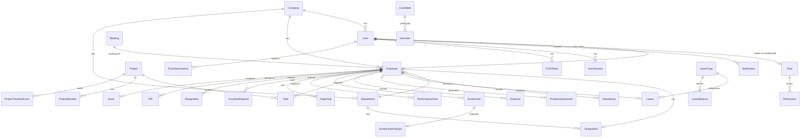

# PROJECT REFERENCE BIBLE — Talio HRMS

> **Auto-generated:** 2026-06-27 | **Audit scope:** Full-stack reverse engineering  
> **Purpose:** Single source of truth for onboarding, debugging, and architecture.

---

## 1. Executive Summary

Talio is a **multi-tenant Human Resource Management System (HRMS)** with workforce productivity tracking, AI-powered screenshot analysis, real-time collaboration (chat, WebRTC meetings), attendance/geofencing, leave/expense management, recruitment, payroll, and RBAC. It serves multiple companies from a single deployment using **dynamic MongoDB tenant databases** isolated per organization. A companion **Electron desktop app** captures periodic screenshots for productivity analysis, and an **Expo mobile app** (`talioapp/`) extends the platform to Android/iOS.

### Stack Snapshot

| Layer        | Technology                                    |
|--------------|-----------------------------------------------|
| Language     | JavaScript (ESM + CommonJS hybrid)            |
| Runtime      | Node.js **20** (exact version in `.nvmrc`)    |
| Framework    | Next.js **15.5.12** (App Router, custom server) |
| UI           | React **19.0.0**, HeroUI v2, Tailwind CSS 3   |
| Database     | MongoDB **7.x** (Mongoose **8.9.3**), multi-tenant |
| Cache        | Redis **4.6.13** (Cloud Redis)                |
| Queue        | BullMQ **5.70.1** (Redis-backed)              |
| Real-time    | Socket.IO **4.8.1** (WebSocket + polling)     |
| AI           | Gemini (exclusive, multi-key rotation via REST API) |
| Email        | Nodemailer **7.0.7** (SMTP)                   |
| Monitoring   | Sentry **10.37.0**                            |
| Testing      | Jest **30.3.0** + @swc/jest + mongodb-memory-server |
| Container    | Docker multi-stage (Debian Bookworm) + nginx + certbot |

---

## 2. Setup Guide (Zero-to-Hero)

### 2.1 Prerequisites

| Tool          | Exact Version       | How to Install                                      |
|---------------|---------------------|-----------------------------------------------------|
| Node.js       | **20.x** (LTS)      | `nvm install 20 && nvm use 20`                      |
| npm           | 10.x (bundled)      | Comes with Node 20                                  |
| MongoDB       | 7.x (Atlas or local)| [MongoDB Atlas](https://cloud.mongodb.com) or `mongod` |
| Redis         | 6.x+                | [Redis Cloud](https://redis.com) or `redis-server`  |
| Docker        | 24.x+ (optional)    | `apt-get install docker.io docker-compose-v2`       |
| Git           | any recent          | `apt-get install git`                               |

### 2.2 Environment Variables

> **CRITICAL:** The app reads `.env` (NOT `.env.local`). Copy `.env.example` → `.env`.

| Variable                          | Required | Purpose                                                | How to Get                                        |
|-----------------------------------|----------|--------------------------------------------------------|---------------------------------------------------|
| `MONGODB_URI`                     | **YES**  | MongoDB Atlas connection string (no DB name in URI)    | MongoDB Atlas → Connect → Drivers                 |
| `JWT_SECRET`                      | **YES**  | JWT signing key (min 32 chars)                        | `openssl rand -hex 32`                            |
| `NEXT_PUBLIC_APP_URL`             | REC      | Public base URL for the app                            | Your domain, e.g. `https://app.talio.in`          |
| `CRON_SECRET`                     | REC      | Bearer token for cron job endpoints                   | `openssl rand -base64 32`                         |
| `SUPERADMIN_DB_NAME`              | REC      | Central database for tenant mappings                  | Set to `talio_superadmin`                         |
| `REDIS_URL`                       | OPT      | Redis connection for cache + BullMQ                   | Redis Cloud → Configuration                       |
| `GEMINI_API_KEY_1` … `_7`         | **YES**  | Gemini API keys for rate-limit resilience (at least 2 recommended) | Google AI Studio → API Keys |
| `GEMINI_API_KEY`                  | OPT      | Legacy single-key fallback                             | Google AI Studio → API Keys |
| `GEMINI_API_KEY`                  | OPT      | Gemini API key (tertiary fallback)                     | Google AI Studio → API Keys                       |
| `GEMINI_API_KEY_2` – `_7`        | OPT      | Additional Gemini keys for rotation                    | Multiple Google Cloud projects                    |
| `SMTP_HOST` / `EMAIL_*`           | OPT      | Outbound email (Hostinger SMTP or similar)             | Email provider SMTP settings                      |
| `FCM_SERVER_KEY`                  | OPT      | Firebase Cloud Messaging for push notifications        | Firebase Console → Project Settings → Cloud Messaging |
| `SENTRY_DSN`                      | OPT      | Error monitoring                                       | Sentry → Projects → Settings → DSN                |
| `NEXT_PUBLIC_GOOGLE_MAPS_API_KEY` | OPT      | Google Maps for geofencing                             | Google Cloud Console → Maps API                   |
| `GOOGLE_CLIENT_ID/SECRET`         | OPT      | Google OAuth sign-in                                   | Google Cloud Console → OAuth 2.0                  |
| `LINKEDIN_CLIENT_ID/SECRET`       | OPT      | LinkedIn recruitment integration                       | LinkedIn Developer Portal                         |
| `IMAGEKIT_PUBLIC/PRIVATE_KEY`     | OPT      | ImageKit for legacy image uploads                      | ImageKit Dashboard                                |
| `ELEVENLABS_API_KEY`              | OPT      | ElevenLabs TTS for AI voice                            | ElevenLabs Dashboard                              |
| `NEXT_PUBLIC_MEETING_STUN_URLS`   | OPT      | STUN servers for WebRTC                                | Google STUN (free) or your own                    |
| `GITHUB_TOKEN`                    | OPT      | GitHub API for release downloads                       | GitHub → Settings → Developer Settings → PAT      |
| `GITHUB_WEBHOOK_SECRET`           | OPT      | Webhook secret for GitHub release events               | `openssl rand -hex 32`                            |
| `INTEGRATION_TOKEN_ENCRYPTION_KEY`| OPT      | AES-256 key for LinkedIn token encryption              | `openssl rand -hex 32`                            |
| `ONBOARDING_PASSWORD_KEY`         | OPT      | AES-256 key for onboarding password encryption         | `node -e "console.log(require('crypto').randomBytes(32).toString('hex'))"` |
| `DAILY_PRODUCTIVITY_CRON`         | OPT      | Override cron schedule (default: `*/15 * * * *`)       | Standard cron expression                          |
| `EMAIL_QUEUE_CRON`                | OPT      | Override email drain schedule (default: `* * * * *`)   | Standard cron expression                          |

### 2.3 Installation Steps

```bash
# 1. Clone & enter
git clone <repo-url> talio && cd talio

# 2. Ensure Node 20
nvm use 20

# 3. Install dependencies
npm install

# 4. Configure environment
cp .env.example .env
# Edit .env — set MONGODB_URI and JWT_SECRET at minimum

# 5. Seed superadmin data (development only)
npm run seed

# 6. Start development server (includes Socket.IO)
npm run dev
# Server runs on http://localhost:3000
# Socket.IO on /api/socketio
```

### 2.4 Docker Setup

```bash
# Build and start all services (app + nginx + certbot)
docker compose up -d --build

# Check health
docker compose ps
curl http://localhost:3000/api/health
```

### 2.5 Seed Data

| Script                  | Purpose                                               |
|-------------------------|-------------------------------------------------------|
| `npm run seed`          | Create departments, designations, employees, users    |
| `scripts/register-first-tenant.js` | Register first company as a tenant        |
| `scripts/seed-superadmin.js` | Seed superadmin user in central DB              |

---

## 3. Architectural Blueprint

### 3.1 Data Flow (Request Lifecycle)

```
Client (Browser / Electron / Mobile)
  │
  ▼
┌──────────────────────────────────────────────────────┐
│  Nginx (reverse proxy)                               │
│  • TLS termination (certbot)                         │
│  • Gzip compression                                  │
│  • Rate limiting: 30r/s /api, 50r/s general          │
│  • Static file serving: /_next/static, /public       │
│  • Proxy / → talio-app:3000                          │
└──────────────────────┬───────────────────────────────┘
                       │
                       ▼
┌──────────────────────────────────────────────────────┐
│  Next.js Custom Server (server.js)                    │
│  • Port 3000                                         │
│  • Environment validation on boot                    │
│  • Socket.IO attached at /api/socketio               │
│  • API response time logging (X-Response-Time)       │
└──────────────────────┬───────────────────────────────┘
                       │
                       ▼
┌──────────────────────────────────────────────────────┐
│  Next.js Middleware (middleware.js)                   │
│  • JWT verification (jose) with in-memory cache       │
│  • Passes verified payload via x-verified-* headers  │
│  • Route classification: public / protected / superadmin│
│  • /resources → 301 redirect to talio.in             │
│  • Socket.IO excluded from middleware checks         │
└──────────────────────┬───────────────────────────────┘
                       │
                       ▼
┌──────────────────────────────────────────────────────┐
│  API Route Handler (app/api/**/route.js)              │
│  • Calls getAuthAndModels() from lib/auth.js         │
│  • Gets tenant-specific Mongoose models              │
│  • Business logic executed                           │
│  • Events emitted via global.io (Socket.IO)          │
└──────────────────────┬───────────────────────────────┘
                       │
                       ▼
┌──────────────────────────────────────────────────────┐
│  Data Layer                                          │
│  ┌─────────────────────┐  ┌──────────────────────┐  │
│  │ Central DB           │  │ Tenant DB             │  │
│  │ talio_superadmin     │  │ talio_company_{slug}  │  │
│  │ • UserTenantMapping  │  │ • Users, Employees    │  │
│  │ • TenantCompany      │  │ • Attendance, Leave   │  │
│  │ • SuperAdmin         │  │ • Projects, Tasks     │  │
│  │ • SystemPreferences  │  │ • All 70+ collections │  │
│  └─────────────────────┘  └──────────────────────┘  │
│  ┌─────────────────────┐                             │
│  │ Redis Cache          │                             │
│  │ • Auth user cache    │                             │
│  │ • Dashboard cache    │                             │
│  │ • Query cache        │                             │
│  │ • BullMQ queues      │                             │
│  └─────────────────────┘                             │
│  ┌─────────────────────┐                             │
│  │ GridFS (MongoDB)     │                             │
│  │ • Screenshot storage │                             │
│  │ • File uploads       │                             │
│  │ • ImageKit fallback  │                             │
│  └─────────────────────┘                             │
└──────────────────────────────────────────────────────┘
```

### 3.2 Database Schema (Main Collections)

> Each tenant database has ~70 collections. These are the core ones:



### 3.3 API Reference

| Method | Path                                       | Purpose                                  | Auth     |
|--------|--------------------------------------------|------------------------------------------|----------|
| GET    | `/api/health`                              | Liveness/readiness probe                 | Public   |
| GET    | `/api/redis-status`                        | Redis connectivity check                 | Public   |
| POST   | `/api/auth/login`                          | User login (returns JWT)                 | Public   |
| POST   | `/api/auth/register`                       | User registration                        | Public   |
| GET    | `/api/auth/session`                        | Validate session                         | Public   |
| POST   | `/api/auth/google/callback`                | Google OAuth callback                    | Public   |
| POST   | `/api/auth/change-password`                | Change password (force-change flow)      | JWT      |
| GET    | `/api/attendance/*`                        | Attendance CRUD + geolocation check-in   | JWT      |
| GET    | `/api/leave/*`                             | Leave requests, balances, types          | JWT      |
| GET    | `/api/employees/*`                         | Employee CRUD, hierarchy                 | JWT      |
| GET    | `/api/projects/*`                          | Project CRUD, members, timeline          | JWT      |
| GET    | `/api/tasks/*`                             | Task CRUD, assignments, status           | JWT      |
| GET    | `/api/dashboard/*`                         | Dashboard stats, analytics               | JWT      |
| GET    | `/api/productivity/*`                      | Productivity sessions, analysis          | JWT      |
| POST   | `/api/activity/screenshot`                 | Desktop app screenshot upload            | JWT      |
| GET    | `/api/meetings/*`                          | Meeting CRUD, WebRTC signaling           | JWT      |
| GET    | `/api/chat/*`                              | Chat messages, rooms                     | JWT      |
| GET    | `/api/notifications/*`                     | Notification CRUD, preferences           | JWT      |
| GET    | `/api/recruitment/*`                       | Job postings, candidates, LinkedIn       | JWT      |
| GET    | `/api/payroll/*`                           | Payroll processing                       | JWT      |
| GET    | `/api/expenses/*`                          | Expense submissions, approvals           | JWT      |
| GET    | `/api/performance/*`                       | Performance reviews, goals               | JWT      |
| GET    | `/api/holidays/*`                          | Holiday calendar                          | JWT      |
| GET    | `/api/policies/*`                          | Company policies                          | JWT      |
| GET    | `/api/documents/*`                         | Document management                       | JWT      |
| GET    | `/api/assets/*`                            | Asset tracking                            | JWT      |
| GET    | `/api/helpdesk/*`                          | Helpdesk tickets                          | JWT      |
| GET    | `/api/whiteboard/*`                        | Collaborative whiteboard                  | JWT      |
| GET    | `/api/departments/*`                       | Department CRUD                           | JWT      |
| GET    | `/api/designations/*`                      | Designation CRUD                          | JWT      |
| POST   | `/api/setup/check`                         | Check if setup is needed                  | Public   |
| POST   | `/api/setup/create-admin`                  | Create initial admin                      | Public   |
| GET    | `/api/setup/tenant`                        | Tenant setup with setup code              | Public   |
| GET    | `/api/images/*`                            | GridFS image serving (by fileId)          | Public   |
| GET    | `/api/latest-release`                      | Latest desktop app release metadata       | Public   |
| GET    | `/api/desktop/min-version`                 | Minimum desktop app version               | Public   |
| POST   | `/api/cron/process-email-queue`            | Drain queued emails                       | CRON_SECRET |
| POST   | `/api/cron/daily-productivity-cleanup`     | End-of-day productivity analysis          | CRON_SECRET |
| POST   | `/api/cron/process-scheduled-notifications`| Process scheduled/recurring notifications | CRON_SECRET |
| POST   | `/api/cron/auto-checkout`                  | Auto checkout employees                   | CRON_SECRET |
| POST   | `/api/cron/mark-absent`                    | Mark absent employees                     | CRON_SECRET |
| POST   | `/api/cron/subscription-reminders`         | Subscription renewal reminders            | CRON_SECRET |
| POST   | `/api/cron/todo-reminders`                 | Personal todo reminders                   | CRON_SECRET |
| GET    | `/api/superadmin/*`                        | Superadmin dashboard & management         | SuperAdmin JWT |
| POST   | `/api/webhooks/github-release`             | GitHub release webhook                    | GitHub Secret |
| POST   | `/api/recruitment/webhooks/linkedin`       | LinkedIn recruitment webhook              | LinkedIn Secret |

---

## 4. Operational Guide

### 4.1 Logging

| Source         | Destination                            | Format                 |
|----------------|----------------------------------------|------------------------|
| App server     | `stdout` / Docker `json-file` driver   | `[boot]`, `[AUTH]`, `[Socket.IO]` prefixes |
| Nginx          | `/var/log/nginx/access.log`, `error.log` | Standard combined format |
| Docker         | JSON file logs (10MB max, 3 files)     | `docker logs talio-app` |
| Slow APIs      | `stdout` — `🐌 SLOW API [Xms]`        | Warns if >2 seconds    |
| Sentry         | Sentry ingest endpoint                 | Error + performance    |

### 4.2 Health Checks

| Endpoint             | Method | Purpose                          | Response            |
|----------------------|--------|----------------------------------|---------------------|
| `/api/health`        | GET    | Docker healthcheck (liveness)    | `{"status":"ok"}`   |
| `/api/health`        | HEAD   | Lightweight probe                | 200 (no body)       |
| `/api/health?detailed=true` | GET | Full check (MongoDB + Redis) | Extended status     |
| `/api/redis-status`  | GET    | Redis connectivity                | `{"redis":"connected"}` |

### 4.3 Background Jobs (In-Process Cron via `node-schedule`)

| Job                        | Schedule         | Description                                           |
|----------------------------|------------------|-------------------------------------------------------|
| Notification Processor     | Every minute     | Processes due ScheduledNotification + RecurringNotification rows |
| Attendance Processor       | Every minute     | Auto check-out, absent marking, geofence checks       |
| Email Queue Drain          | Every minute     | Drains OnboardingEmail + ProjectEmailNotificationLog  |
| Meeting Finalizer          | Every minute     | Marks past meetings complete, generates AI summaries  |
| Daily Productivity Cleanup | Every 15 min     | End-of-day productivity analysis + screenshot purge per tenant timezone |
| Screenshot Retention       | Every 15 min     | Enforces 48-hour screenshot retention (safety net)    |
| Latest Release Checker     | Every 15 min     | Fetches latest GitHub release metadata                |

### 4.4 Socket.IO Architecture

- **Path:** `/api/socketio` (configured in `server.js`)
- **Auth:** JWT token passed in handshake `auth.token`
- **Rooms:** `user:{userId}`, `tenant:{databaseName}`, `chat:{chatId}`, `project:{projectId}`, `meeting:{roomId}`
- **Presence:** In-memory map `presenceByEmployee` / `presenceByUserId` tracks online status
- **Desktop app registration:** Sets `socket.isDesktopApp = true` for targeted push notifications
- **Emissions guarded by:** `if (global.io) global.io.to(\`user:${userId}\`).emit(...)`

### 4.5 Email Flow

```
API Route → emailQueueCron (in-process) → /api/cron/process-email-queue
  → OnboardingEmail / ProjectEmailNotificationLog (MongoDB collection)
  → Nodemailer → SMTP (Hostinger)
```

---

## 5. Troubleshooting

### 5.1 "Missing REQUIRED env vars" on startup

**Symptom:** Server exits immediately with `❌ Missing REQUIRED env vars: JWT_SECRET, MONGODB_URI`.

**Fix:** Copy `.env.example` to `.env` and set at minimum `MONGODB_URI` and `JWT_SECRET`. The server explicitly requires `.env` (not `.env.local`). In development it only warns; in production it `process.exit(1)`.

### 5.2 MongoDB Atlas SRV Resolution Failure (`querySrv ETIMEOUT`)

**Symptom:** `MongooseServerSelectionError: querySrv ETIMEOUT _mongodb._tcp.cluster.mongodb.net`.

**Fix:** The app configures Google DNS (`8.8.8.8`, `8.8.4.4`, `1.1.1.1`) via `lib/mongodb.js` and `lib/tenantDb.js`. If still failing:
1. Verify your network allows DNS SRV queries (some corporate firewalls block them).
2. Switch the MongoDB URI from `mongodb+srv://` to standard `mongodb://` format with explicit host:port.
3. Check MongoDB Atlas IP whitelist includes your outbound IP.

### 5.3 JWT Token Rejection After Login (`Invalid session - please log in again`)

**Symptom:** User logs in successfully but API calls return 401.

**Root cause:** The JWT payload is missing `databaseName` — the multi-tenant system requires every JWT to carry the tenant database. This happens when:
- The user was created before multi-tenant was enabled (no `UserTenantMapping` in `talio_superadmin`).
- The login API didn't resolve the tenant correctly.

**Fix:** Verify the `UserTenantMapping` collection in `talio_superadmin` has a row mapping the user's email to a `TenantCompany` with a valid `databaseName`. Re-login after fixing the mapping.

### 5.4 Socket.IO Not Connecting (Polling Only)

**Symptom:** Client falls back to HTTP long-polling and WebSocket upgrade fails.

**Fix:** Socket.IO path is `/api/socketio` (not `/socket.io`). Verify nginx config proxies WebSocket upgrades correctly — the `nginx/conf.d/` should have `proxy_set_header Upgrade $http_upgrade` and `proxy_set_header Connection "upgrade"` for the `/api/socketio` location block.

### 5.5 AI Provider Fails Silently (No Productivity Analysis)

**Symptom:** Screenshots are uploaded but never analyzed.

**Debug:** Check logs for `[AIRouter]` and `[Gemini]` entries. Only Gemini is used now. Primary model is `gemini-3.5-flash` with fallback chain → `gemini-2.5-flash` → `gemini-flash-latest` → `gemini-2.0-flash`. Ensure at least 1 key is set via `GEMINI_API_KEY_1`. Keys rotate automatically on 429; check `lib/ai/keyRotationManager.js` for cooldown logic. Model fallbacks are tried when a model returns 404.

---

## Appendix: File Map (Key Files)

| File / Directory                  | Role                                               |
|-----------------------------------|----------------------------------------------------|
| `server.js`                       | Custom Next.js + Socket.IO server entry point      |
| `middleware.js`                   | JWT verification, route classification, redirects   |
| `next.config.js`                  | Next.js config (security headers, CSP, image optimization) |
| `lib/auth.js`                     | `getAuthAndModels()` — THE tenant auth helper       |
| `lib/tenantModels.js`             | All 70+ Mongoose schemas per tenant                 |
| `lib/tenantDb.js`                 | Dynamic tenant DB connection manager                |
| `lib/mongodb.js`                  | Central MongoDB connection (superadmin DB)          |
| `lib/superadminDb.js`             | Superadmin DB URI resolution                       |
| `lib/superadminAuth.js`           | Superadmin JWT verification                         |
| `lib/gemini.js`                   | AI shim → `lib/ai/aiProviderManager.js`             |
| `lib/ai/aiProviderManager.js`     | Gemini-only AI router with retry logic               |
| `lib/ai/providers/geminiProvider.js` | Gemini REST API client with multi-key rotation     |
| `lib/realtimeEvents.js`           | Socket.IO event name constants                      |
| `lib/scheduler.js`                | In-process notification + attendance cron           |
| `lib/productivityQueue.js`        | AI screenshot analysis queue                        |
| `lib/dailyProductivityCron.js`    | Daily productivity close cron                       |
| `lib/emailQueueCron.js`           | Queued email drain cron                             |
| `lib/meetingFinalizerCron.js`     | Meeting auto-finalize + AI summary cron             |
| `lib/cache.js`                    | Redis cache helper (with in-memory fallback)        |
| `lib/gridfs.js`                   | GridFS file storage (primary upload store)          |
| `lib/imagePipeline.js`            | Image processing (resize, EXIF strip, WebP convert) |
| `lib/mailer.js`                   | Nodemailer SMTP transport                           |
| `lib/fcmHelper.js`                | Firebase Cloud Messaging push notifications         |
| `lib/passwordEncryption.js`       | AES-256-GCM onboarding password encryption          |
| `lib/secretEncryption.js`         | General secret encryption for integrations          |
| `contexts/SocketContext.js`       | Client-side Socket.IO provider (React context)      |
| `models/`                         | 70+ Mongoose model files (shared reference)         |
| `app/api/`                        | 60+ API route groups                               |
| `app/layout.js`                   | Root layout (fonts, providers, splash)              |
| `app/page.js`                     | Root page (auth check → redirect)                   |
| `components/`                     | 80+ React components                               |
| `docker-compose.yml`              | Docker services: app + nginx + certbot              |
| `Dockerfile`                      | 4-stage Docker build (deps → prod-deps → builder → runner) |
| `nginx/nginx.conf`                | Nginx main config (gzip, rate limiting)             |
| `jest.config.js`                  | 2-project Jest config (server + web)                |
| `scripts/seed.js`                 | Development seed data                               |
| `desktop-app/`                    | Electron desktop app for screenshot capture         |
| `.env.example`                    | Full environment variable reference                 |
